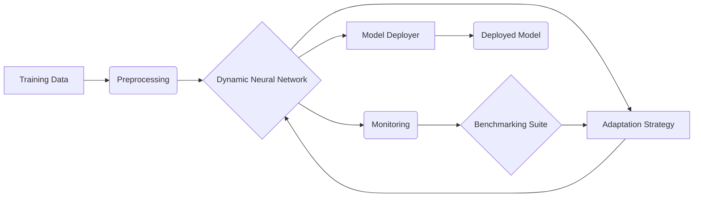

# Dynamic Neural Network Refinement - Architecture

## Overview
Dynamic Neural Network Refinement (DNNR) is a flexible, adaptive, and continuously refining framework for ai models. It performs on-the-fly tuning of neural parameters, allowing for real-time model adjustment.

## Repository Structure
```
.
├── config/        # Configuration files (YAML, JSON)
├── crypto_utils/  # Utilities for cryptographic operations
├── demos/         # Demonstration notebooks and scripts
├── deploy/        # Deployment related files and scripts
├── dnnr/          # Core dynamic neural network refinement library
├── docs/          # Documentation files
├── grafana/       # Grafana dashboard configurations
├── monitoring/    # Monitoring scripts and configurations
├── notebooks/     # Jupyter notebooks for experimentation and analysis
├── prometheus/    # Prometheus monitoring configurations
├── scripts/       # Various scripts for training, evaluation, etc.
├── secure_execution/ # Scripts and configurations for secure execution environments
├── src/           # Source code for the project
├── tests/         # Test suites
├── utils/         # Utility scripts and modules
└── visualization/ # Visualization tools and scripts

## Key Components

- **Adaptation Strategies:** Implement different strategies for adapting the neural network architecture during runtime.
- **Benchmarking Suite:** Provides tools for evaluating the performance of different network configurations.
- **Core Modules:** Contains the core logic for dynamic layer creation, evolutionary search, and fault tolerance.
- **Monitoring Tools:** Enables real-time monitoring of network performance and resource utilization.
- **Security Modules:** Implements security measures to protect the model from adversarial attacks.

## Architecture Diagram


